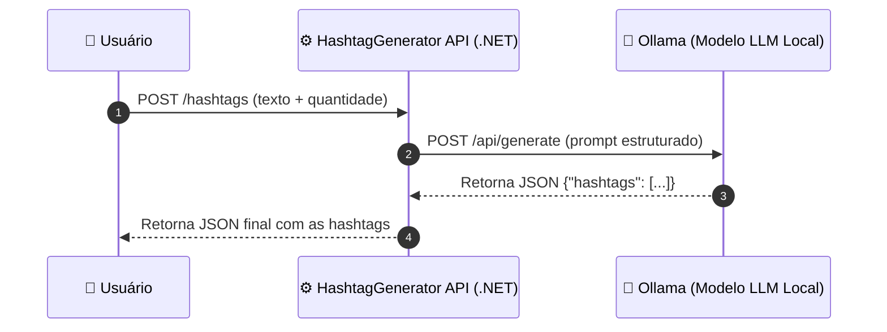

<div align="center">
  
  
  <h1><i><b>Hashtag Generator API</b></i> - Checkpoint (FIAP)</h1>
  <p><b>Disciplina:</b> Advanced Business Development with .NET</p>
  <p><b>Professor Orientador:</b> Leonardo Gasparini Romão</p>
  <p>Minimal API desenvolvida em <b>.NET 8</b> que integra com o <b>Ollama</b> para geração inteligente de hashtags via modelo de linguagem local.</p>
</div>

<p align="center">
  🔗 <a href="https://github.com/leomotalima/HashtagGeneratorApi"><b>Repositório Oficial no GitHub</b></a>
</p>

---

## 🏷️ Etiquetas
[](https://dotnet.microsoft.com/)
[](https://learn.microsoft.com/aspnet/core)
[](https://ollama.com/)
[](https://choosealicense.com/licenses/mit/)
[](https://www.fiap.com.br/)

---

## 🎯 Visão Geral

O **Hashtag Generator API** é uma **Minimal API** desenvolvida em **.NET 8** que utiliza o **Ollama** — um modelo de linguagem local — para gerar hashtags relevantes a partir de textos enviados pelo usuário.

O projeto demonstra o uso prático de:
- Consumo de **APIs REST locais** com `HttpClient`;
- **Structured Outputs (JSON Schema)**;
- **Boas práticas REST**;
- Integração com IA **executando localmente**, sem dependência de nuvem.

> 💡 Desenvolvido como parte da disciplina **Advanced Business Development with .NET**, aplicando integração de APIs com Inteligência Artificial Local (Ollama).

---

## 🎥 Demonstração do Projeto

Assista à demonstração completa da **Hashtag Generator API** desenvolvida como parte da disciplina *Advanced Business Development with .NET (FIAP)*:

<div align="center">

[](https://youtu.be/_2VPrjS74WY)

</div>

---

## 🧠 Arquitetura do Sistema

O projeto segue uma arquitetura **Minimalista e Configurável**, separando lógica e parâmetros no `appsettings.json`.

### 🧩 Diagrama de Fluxo (Mermaid)



---

## ⚙️ Funcionalidades Principais

- ✅ Endpoint `POST /hashtags` para geração de hashtags  
- 🧩 Integração local com **Ollama API**  
- ⚙️ Configuração flexível via `appsettings.json`  
- 📡 Consumo com `HttpClient`  
- 💾 Teste via arquivo `.http` ou Postman  
- 🧱 Estrutura limpa e extensível  

---

## 🧰 Tecnologias Utilizadas

- **.NET 8 (Minimal API)**
- **C# 12**
- **Ollama (local LLM)**
- **HttpClient**
- **Swagger / JSON**
- **VS Code / Postman**

---

## 🧩 Estrutura do Projeto

```
HASHTAGGENERATORAPI/
├── bin/
├── Controllers/
│   └── HashtagController.cs
├── docs/
│   ├── arquitetura.md
│   ├── diagrama_fluxo.md
│   └── endpoints.md
├── Models/
│   ├── HashtagRequest.cs
│   └── HashtagResponse.cs
├── obj/
├── Services/
│   └── OllamaService.cs
├── .gitattributes
├── .gitignore
├── appsettings.json
├── HashtagGeneratorAPI_Demo.mp4
├── HashtagGeneratorApi.csproj
├── Program.cs
├── README.md
└── test.http
```

> 🎥 O vídeo `HashtagGeneratorAPI_Demo.mp4` demonstra a execução completa do projeto — também disponível no YouTube: [https://youtu.be/_2VPrjS74WY](https://youtu.be/_2VPrjS74WY)

---

## 📄 Documentação da API

### 🔹 Geração de Hashtags

```http
POST /hashtags
Content-Type: application/json

{
  "text": "Inteligência Artificial aplicada em análise de dados",
  "count": 8,
  "model": "llama3:latest"
}
```

**Resposta esperada:**
```json
{
  "hashtags": [
    "#InteligenciaArtificial",
    "#DataScience",
    "#MachineLearning",
    "#BigData",
    "#Automacao"
  ]
}
```

---

## ⚙️ Configuração e Execução

### 1️⃣ Instalar o .NET 8
Baixe em: [https://dotnet.microsoft.com/download](https://dotnet.microsoft.com/download)

### 2️⃣ Instalar o Ollama
Baixe e instale via [https://ollama.com/download](https://ollama.com/download)

### 3️⃣ Baixar modelo leve
```bash
ollama pull llama3.2:3b
```

### 4️⃣ Confirmar se o Ollama está rodando
```bash
curl http://localhost:11434/api/tags
```

### 5️⃣ Executar a API
```bash
dotnet run
```

### 6️⃣ Testar o endpoint
Use o `test.http` ou Postman para enviar o POST `/hashtags`.

---

## 🧩 appsettings.json (exemplo)

```json
{
  "Ollama": {
    "BaseUrl": "http://localhost:11434",
    "Model": "llama3.2:3b"
  }
}
```

---

## 🧪 Testes Locais

Execute:
```bash
dotnet run
```

A aplicação responderá em:
```
http://localhost:5000
```

Envie requisições com:
- `test.http` (VS Code)
- `curl`
- `Postman`

---

## 🧠 Aprendizados

Durante o desenvolvimento, foram aplicadas:
- Boas práticas de integração API ↔️ IA Local;
- Prompts estruturados e controle de saída JSON;
- Configuração de ambiente via `appsettings.json`;
- Uso de Minimal API com código limpo e eficiente.

---

## 📚 Documentação Técnica

Para uma visão detalhada da arquitetura, fluxo e endpoints da aplicação, consulte os arquivos abaixo:

| Documento | Descrição |
|------------|------------|
| [🏗️ Arquitetura do Sistema](docs/arquitetura.md) | Estrutura geral da API, camadas e responsabilidades. |
| [🔄 Diagrama de Fluxo](docs/diagrama_fluxo.md) | Fluxo completo da requisição, do cliente ao Ollama Server. |
| [🧩 Endpoints da API](docs/endpoints.md) | Detalhamento das rotas, parâmetros e exemplos de requisições. |

---

📦 **Repositório GitHub:** [leomotalima/HashtagGeneratorApi](https://github.com/leomotalima/HashtagGeneratorApi)

---

## 👨‍💻 Autor

| Nome | RM | Responsabilidade |
|------|----|------------------|
| **Léo Mota Lima** | 557851 | Desenvolvimento da API, integração com Ollama, documentação e diagrama técnico |

---

## 📜 Licença

Distribuído sob a licença **MIT**.  
Consulte [LICENSE](https://choosealicense.com/licenses/mit/) para mais detalhes.

---

## 🔗 Referências

- [Ollama Docs](https://ollama.com/library)
- [Microsoft Docs – Minimal APIs](https://learn.microsoft.com/aspnet/core/fundamentals/minimal-apis)
- [FIAP - Advanced Business Development with .NET](https://www.fiap.com.br/)
