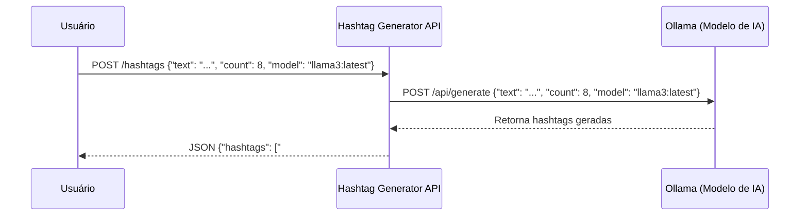

# 📡 Endpoints da Hashtag Generator API

## 📘 Visão Geral
A **Hashtag Generator API** possui um endpoint principal que utiliza o modelo de linguagem local **Ollama** para gerar hashtags inteligentes com base em um texto enviado pelo usuário.  
A API foi desenvolvida em **.NET 8 (Minimal API)** e segue o padrão **RESTful**, retornando dados em **JSON estruturado**.

---

## 🔹 Endpoint Principal

### **POST /hashtags**
Gera uma lista de hashtags relevantes utilizando o modelo definido no campo `model`.

#### 🧭 URL
```
http://localhost:5000/hashtags
```
*(ou a porta configurada no seu ambiente, por exemplo `http://localhost:5182/hashtags`)*

#### 🔧 Método
`POST`

#### 🧾 Cabeçalhos
| Header | Valor |
|:--------|:--------|
| `Content-Type` | `application/json` |
| `Accept` | `application/json` |

---

### 📨 Corpo da Requisição (Request Body)
```json
{
  "text": "Inteligência Artificial aplicada em análise de dados",
  "count": 8,
  "model": "llama3:latest"
}
```

---

### 📤 Exemplo de Resposta (Response 200)
```json
{
  "hashtags": [
    "#InteligenciaArtificial",
    "#AnaliseDeDados",
    "#MachineLearning",
    "#Inovacao",
    "#Tecnologia",
    "#DataScience",
    "#Automacao",
    "#FuturoDigital"
  ]
}
```

---

## ⚠️ Códigos de Erro Possíveis

### ❌ 400 — Requisição Inválida
Ocorre quando o corpo da requisição está incorreto ou faltam campos obrigatórios.

```json
{
  "erro": "Os campos 'text', 'count' e 'model' são obrigatórios."
}
```

---

### ❌ 500 — Erro Interno
Ocorre quando há falha na comunicação com o Ollama.

```json
{
  "erro": "Falha ao gerar hashtags. Verifique o servidor Ollama."
}
```

---

## 🧠 Exemplo de Teste (via arquivo `test.http`)
```http
### Gerar hashtags com o modelo Llama3
POST http://localhost:5000/hashtags
Content-Type: application/json

{
  "text": "Inovação e sustentabilidade na mobilidade urbana",
  "count": 5,
  "model": "llama3:latest"
}
```

---

## 🔄 Fluxo Resumido (Mermaid)


---

## ✅ Boas Práticas Implementadas
- Estrutura **RESTful** simples e eficiente.  
- Requisições e respostas padronizadas em **JSON**.  
- Suporte à escolha de modelo via campo `model`.  
- Tratamento de erros e mensagens descritivas.  
- Testes diretos via **Swagger** ou arquivo `.http`.  

---

## 📎 Referências
- [.NET 8 Minimal APIs](https://learn.microsoft.com/aspnet/core/fundamentals/minimal-apis)  
- [Ollama Documentation](https://ollama.com/)  
- [REST Client for VS Code](https://marketplace.visualstudio.com/items?itemName=humao.rest-client)
